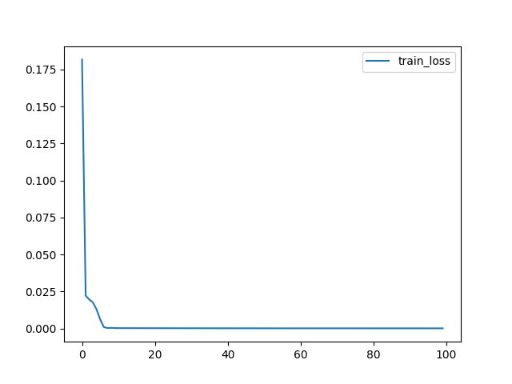
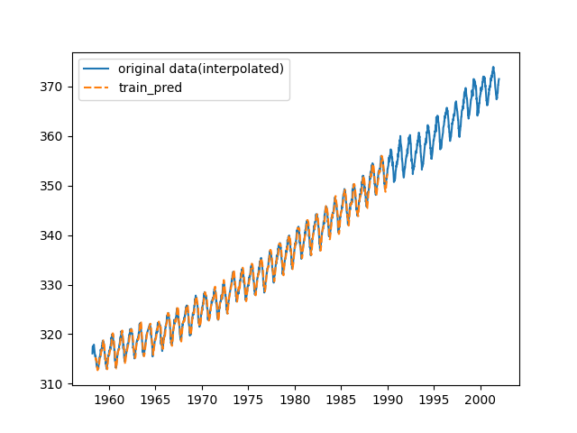
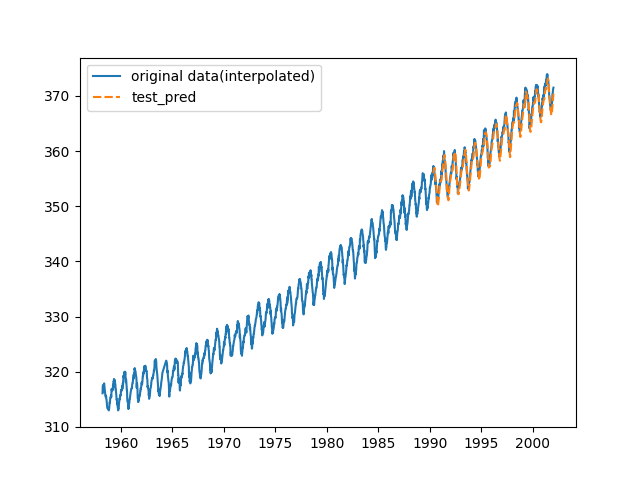

# Implementation RNN model with PyTorch

## Preparing Environment

```
$ docker-compose build
$ docker-compose up -d
# cd /work
```

## Time-series forecasting

Training RNN model to predict atmospheric CO2 dataset with PyTorch.

### Usage

```
$ python3 main.py
```

#### Train result

Trained model is saved to output directory (default is ``./output``).

```
=================================================================
Layer (type:depth-idx)                   Param #
=================================================================
RNN                                      --
├─RNN: 1-1                               4,288
├─Linear: 1-2                            65
=================================================================
Total params: 4,353
Trainable params: 4,353
Non-trainable params: 0
=================================================================
Epoch: 0001, train loss: 0.18180989
Epoch: 0101, train loss: 0.00020127
Epoch: 0201, train loss: 0.00016220
Epoch: 0301, train loss: 0.00012909
Epoch: 0401, train loss: 0.00010191
Epoch: 0501, train loss: 0.00008558
Epoch: 0601, train loss: 0.00007792
Epoch: 0701, train loss: 0.00007569
Epoch: 0801, train loss: 0.00007439
Epoch: 0901, train loss: 0.00007315
```



#### Evaluation result

- Train MSE: 7.194718256823091e-05

- Test MSE: 0.00018282074976957308

